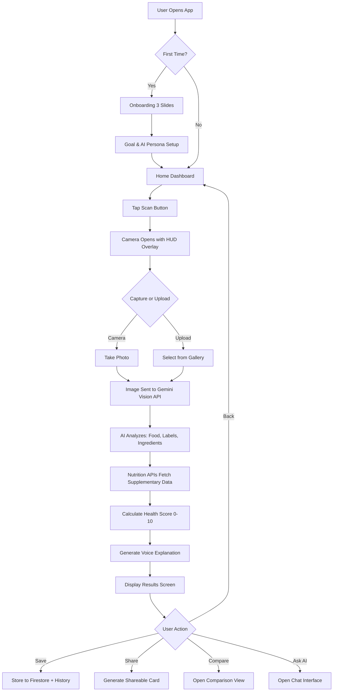

# ScanAndSee — AI Smart Nutrition Assistant
## Full Implementation Plan, Design System & Workflow Reference

> **Purpose:** This document is the single source of truth for building the ScanAndSee web application. It contains every requirement, design token, screen specification, animation behavior, architecture decision, and workflow step needed so that *any* developer or AI agent can pick up where the last one left off.

---

## Table of Contents
1. [Product Vision](#1-product-vision)
2. [Problems Solved](#2-problems-solved)
3. [Target Users](#3-target-users)
4. [Feature Requirements (MVP → V2 → V3)](#4-feature-requirements)
5. [Design System — Cyber-Vitality](#5-design-system--cyber-vitality)
6. [Screen-by-Screen Specification](#6-screen-by-screen-specification)
7. [Animation & Motion Spec](#7-aniamation--motion-spec)
8. [Architecture & Tech Stack](#8-architecture--tech-stack)
9. [Project File Structure](#9-project-file-structure)
10. [AI Pipeline Workflow](#10-ai-pipeline-workflow)
11. [API & Data Contracts](#11-api--data-contracts)
12. [Development Phases & Milestones](#12-development-phases--milestones)
13. [Verification Plan](#13-verification-plan)
14. [Revenue Model](#14-revenue-model)
15. [Key Design Principles](#15-key-design-principles)

---

## 1. Product Vision

> "Make understanding food as easy as taking a photo."

ScanAndSee is an **AI-powered nutrition intelligence platform** that turns any smartphone camera into an instant food analysis engine. Users scan or upload any food item—packaged products, restaurant meals, drinks, supplements, gym products—and receive a deep nutritional breakdown with voice-powered AI coaching in seconds.

It is **not** a calorie-tracking spreadsheet. It is an intelligent, visual, voice-driven health companion that feels like **"Jarvis for food."**

---

## 2. Problems Solved

| Problem | How ScanAndSee Solves It |
|---|---|
| Nutrition labels are confusing | AI explains ingredients in plain language via voice |
| Manual calorie tracking is tedious | One photo does everything—no typing |
| Gym users are confused about products | Dedicated Gym Mode with bulking/cutting/recovery analysis |
| Fake "healthy" marketing tricks consumers | AI Ingredient Danger Detection exposes harmful additives |
| Students need affordable healthy food | Budget Nutrition Optimizer builds meals on any budget |
| People don't know what they eat daily | AI Daily Diet Tracker with weekly health reports |

---

## 3. Target Users

- **Gym Users & Athletes** — protein quality, pre/post workout suitability
- **Students** — budget meals, cheap protein sources
- **Weight Loss Users** — calorie awareness, healthier swaps
- **Parents** — checking packaged foods for children
- **Diabetic Users** — sugar/sodium warnings, personalized advice
- **Fitness Creators** — shareable scan cards for social media
- **Busy Professionals** — instant analysis, no manual input

---

## 4. Feature Requirements

### Phase 1 — MVP (Build First)

| # | Feature | Description | Priority |
|---|---|---|---|
| F1 | **Camera Scan / Upload** | Upload photo or use device camera. Support food photos, packaged products, ingredient labels, meals. | 🔴 Critical |
| F2 | **AI Vision Analysis** | Gemini Vision API analyzes the image → identifies food, reads labels, estimates nutrition. | 🔴 Critical |
| F3 | **Nutrition Results Screen** | Display protein, calories, carbs, fats, sugar, sodium, fiber. Show overall Health Score (0–10) with animated ring. | 🔴 Critical |
| F4 | **AI Voice Explanation** | Text-to-speech explains analysis naturally: "This product contains high sodium…" Uses browser Web Speech API as default, ElevenLabs as premium. | 🔴 Critical |
| F5 | **Ingredient Danger Detection** | Flag harmful additives (palm oil, HFCS, excessive sodium). Show cancer risk, diabetes warning, heart health score. Provide safer alternatives. | 🔴 Critical |
| F6 | **Health Score System** | 0–10 composite score based on nutritional value, harmful ingredients, fitness suitability. Visual animated glowing ring. | 🔴 Critical |
| F7 | **Meal Improvement Suggestions** | AI suggests fixes: "Add eggs for protein", "Reduce seasoning packet by half." | 🟡 High |
| F8 | **Scan History** | Store recent scans with thumbnails, scores, and dates. Accessible from dashboard. | 🟡 High |

### Phase 2 — Enhanced Experience

| # | Feature | Description | Priority |
|---|---|---|---|
| F9 | **Gym Mode / Fitness Mode** | Toggle mode that evaluates food for: bulking, cutting, lean muscle, pre-workout, post-workout. Shows protein quality score, amino acid estimate, muscle recovery score. | 🟡 High |
| F10 | **AI Voice Personalities** | Selectable voices: Doctor, Gym Bro, Motivational Coach, Savage Roast, Anime Girl. Roast mode example: "Bro this snack has more sugar than your future." | 🟡 High |
| F11 | **Product Comparison** | Upload/scan 2 products side-by-side. AI compares: healthier option, cheaper nutrition, better protein, fewer chemicals. | 🟡 High |
| F12 | **"Can I Eat This?" Q&A** | Interactive chat: "Can diabetics eat this?", "Good for weight loss?", "Can I eat this at night?" | 🟡 High |
| F13 | **Daily Diet Tracker** | Track daily intake from scans. Show daily nutrition score, protein intake progress, calorie trends. | 🟡 High |
| F14 | **Personalized Goals** | Set goals: weight loss, muscle gain, bulking, cutting, diabetic-friendly, student budget. AI adapts all recommendations. | 🟡 High |
| F15 | **Barcode Scanner** | Scan product barcode → fetch nutrition from Open Food Facts / USDA APIs. | 🟢 Medium |
| F16 | **Shareable Result Cards** | Generate Instagram/TikTok-ready scan result cards with health score, macros, AI verdict. | 🟢 Medium |

### Phase 3 — Viral & Social

| # | Feature | Description | Priority |
|---|---|---|---|
| F17 | **Mood & Brain Analysis** | Predict energy crash risk, focus impact, sleep impact, mood effect from food. | 🟢 Medium |
| F18 | **AI Health Risk Prediction** | Predict long-term: obesity risk, diabetes pattern, protein deficiency trends. Visual charts. | 🟢 Medium |
| F19 | **Budget Nutrition Optimizer** | User enters daily budget (e.g., ₹300) → AI builds protein meals, grocery lists. | 🟢 Medium |
| F20 | **"Build My Plate" AI** | Scan available foods → AI creates optimized meal combination. | 🟢 Medium |
| F21 | **Smart Supplement Analyzer** | Deep analysis of whey, creatine, pre-workout: fake claims, protein quality, hidden ingredients, overdose risks. | 🟢 Medium |
| F22 | **Community & Leaderboards** | Users post scans, leaderboard: Healthiest Eater, Protein King. Gamification. | 🔵 Future |
| F23 | **Fake Product Detection** | AI checks for duplicate/fake supplements, expired items. Important for Nepal/India market. | 🔵 Future |
| F24 | **AI Grocery Cart Analysis** | Scan entire grocery cart → AI says: "too much sugar, low protein, missing fiber, healthier swaps." | 🔵 Future |
| F25 | **Restaurant Food Scanner** | Upload restaurant meal → estimate calories, oil, protein, unhealthy ingredients. | 🔵 Future |

---

## 5. Design System — Cyber-Vitality

### 5.1 Brand Personality

**"High-Performance Futurism"** — Elite athletic discipline meets cutting-edge digital aesthetics. Targets Gen Z gym enthusiasts who view nutrition as bio-hacking. The emotional response is empowerment, precision, and high energy—like stepping into a sci-fi cockpit HUD.

> [!IMPORTANT]
> The website must NOT look AI-generated. Use proper **icon libraries** (Lucide, Phosphor, or Heroicons) instead of emoji throughout the entire UI.

### 5.2 Color Palette

```yaml
# Foundation
background:        '#131315'   # Deep void canvas
surface:           '#131315'
surface-dim:       '#131315'
surface-bright:    '#39393b'
surface-container-lowest:  '#0e0e10'
surface-container-low:     '#1c1b1d'
surface-container:         '#201f21'
surface-container-high:    '#2a2a2c'
surface-container-highest: '#353437'

# Text
on-surface:          '#e5e1e4'
on-surface-variant:  '#b9ccb2'
inverse-surface:     '#e5e1e4'
inverse-on-surface:  '#313032'

# Borders
outline:          '#84967e'
outline-variant:  '#3b4b37'
surface-tint:     '#00e639'

# Primary — Electric Green (Vitality, Growth, Energy)
primary:              '#ebffe2'
on-primary:           '#003907'
primary-container:    '#00ff41'      # THE hero accent
on-primary-container: '#007117'
inverse-primary:      '#006e16'

# Secondary — Cyber Cyan (Data, AI Scanning, Tech)
secondary:              '#d3fbff'
on-secondary:           '#00363a'
secondary-container:    '#00eefc'
on-secondary-container: '#00686f'

# Tertiary — Neon Magenta (Alerts, Protein Highlights, Energy)
tertiary:              '#fff7f9'
on-tertiary:           '#5e0053'
tertiary-container:    '#ffcfee'
on-tertiary-container: '#b1009f'

# Semantic
error:              '#ffb4ab'
on-error:           '#690005'
error-container:    '#93000a'
on-error-container: '#ffdad6'

# Fixed Variants
primary-fixed:             '#72ff70'
primary-fixed-dim:         '#00e639'
secondary-fixed:           '#7df4ff'
secondary-fixed-dim:       '#00dbe9'
tertiary-fixed:            '#ffd7f0'
tertiary-fixed-dim:        '#fface8'
```

#### Glow Effect Rule
All accent-colored elements must use a **4–8px box-shadow blur** of the same hue at 40–60% opacity to simulate light emission:
```css
/* Example: Primary glow */
box-shadow: 0 0 8px rgba(0, 255, 65, 0.5);

/* Example: Cyan glow */
box-shadow: 0 0 8px rgba(0, 238, 252, 0.5);

/* Example: Magenta glow */
box-shadow: 0 0 8px rgba(255, 172, 232, 0.5);
```

### 5.3 Typography

| Token | Font | Size | Weight | Line Height | Letter Spacing | Usage |
|---|---|---|---|---|---|---|
| `display-lg` | **Sora** | 48px | 800 | 1.1 | 0.05em | Hero headlines |
| `headline-lg` | **Sora** | 32px | 700 | 1.2 | 0.02em | Section titles |
| `headline-lg-mobile` | **Sora** | 24px | 700 | 1.2 | — | Mobile section titles |
| `body-md` | **Hanken Grotesk** | 16px | 400 | 1.6 | 0.01em | Body copy, descriptions |
| `label-tech` | **Space Mono** | 12px | 500 | 1.4 | 0.1em | Data labels, scanning readouts, timestamps |

**Google Fonts import:**
```
Sora:wght@400;700;800
Hanken+Grotesk:wght@400;500;600;700
Space+Mono:wght@400;500;700
```

### 5.4 Border Radius

| Token | Value | Usage |
|---|---|---|
| `rounded-sm` | 2px | Tiny inputs |
| `rounded` | 4px | **Primary radius** — sharp, precision-machined |
| `rounded-md` | 6px | Small cards |
| `rounded-lg` | 8px | Medium containers |
| `rounded-xl` | 12px | **Container radius** — frosted glass cards |
| `rounded-full` | 9999px | Pills, chips, avatars |

### 5.5 Spacing System

Based on **4px increments**: `4, 8, 12, 16, 20, 24, 32, 48, 64`

| Token | Value |
|---|---|
| `gutter` | 16px |
| `margin-mobile` | 20px |
| `margin-desktop` | 40px |
| `container-max` | 1280px |

### 5.6 Layout — Fluid HUD Grid

- **Desktop:** 12-column grid, 40px margins, 16px gutter
- **Mobile:** 4-column grid, 20px margins, 16px gutter
- **HUD Constraints:** Key metrics (Calories, Macros) anchored to peripheral corners or in concentric rings to simulate visor field-of-view
- **Background void framing:** On mobile, glass modules stack vertically with 20px side margins so the dark background "frames" each module

### 5.7 Elevation & Depth (4-Layer System)

| Layer | Description | CSS Properties |
|---|---|---|
| **1. Base** | Deepest background `#050505` | Subtle moving mesh gradients of Cyan + Magenta at 10% opacity |
| **2. Mid (Glass)** | Semi-transparent surfaces | `backdrop-filter: blur(20px); background: rgba(32,31,33,0.4); border: 1px solid rgba(255,255,255,0.15);` |
| **3. Top (Interactive)** | Active/focused elements | `border: 1.5px solid <accent>; box-shadow: 0 0 12px <accent-glow>;` |
| **4. Holographic Overlay** | Non-interactive scan lines, grid patterns | `z-index: highest; opacity: 0.05–0.10; pointer-events: none;` |

### 5.8 Component Specifications

#### Buttons (Clipped Corner)
```css
.btn-primary {
  background: linear-gradient(135deg, #00e639, #00ff41);
  color: #003907;
  font-family: 'Space Mono', monospace;
  font-size: 12px;
  font-weight: 500;
  letter-spacing: 0.1em;
  text-transform: uppercase;
  padding: 12px 24px;
  border: none;
  clip-path: polygon(12px 0%, 100% 0%, calc(100% - 12px) 100%, 0% 100%);
  cursor: pointer;
  transition: box-shadow 0.3s ease, transform 0.2s ease;
}
.btn-primary:hover {
  box-shadow: 0 0 15px rgba(0, 255, 65, 0.6);
  transform: translateY(-1px);
}
```

#### Glass Cards
```css
.glass-card {
  background: rgba(32, 31, 33, 0.4);
  backdrop-filter: blur(20px);
  -webkit-backdrop-filter: blur(20px);
  border: 1px solid rgba(255, 255, 255, 0.15);
  border-radius: 12px;
  padding: 24px;
}
```

#### Glowing Progress Rings
- Multi-layered concentric SVG circles
- Background track: `#353437`
- Progress stroke: gradient from Cyan (`#00eefc`) → Green (`#00e639`)
- Animated stroke-dashoffset on mount
- Inner text: health score number in `display-lg` Sora + glow

#### Scanning Input
```css
.scan-input {
  background: transparent;
  border: none;
  border-bottom: 2px solid #3b4b37;
  color: #e5e1e4;
  font-family: 'Hanken Grotesk', sans-serif;
  font-size: 16px;
  padding: 12px 0;
  transition: border-color 0.3s ease, box-shadow 0.3s ease;
}
.scan-input:focus {
  border-bottom-color: #00eefc;
  box-shadow: 0 2px 8px rgba(0, 238, 252, 0.3);
  outline: none;
}
/* Small "scanning..." animation in corner */
.scan-input::after {
  content: 'scanning...';
  font-family: 'Space Mono', monospace;
  font-size: 10px;
  color: #00eefc;
  animation: blink 1.2s steps(2) infinite;
}
```

#### Nutrient Chips
```css
.chip {
  display: inline-flex;
  align-items: center;
  gap: 6px;
  padding: 4px 12px;
  border-radius: 9999px;
  font-family: 'Space Mono', monospace;
  font-size: 12px;
  letter-spacing: 0.05em;
}
.chip--protein {
  background: rgba(255, 172, 232, 0.15);
  color: #fface8;
}
.chip--healthy {
  background: rgba(0, 230, 57, 0.15);
  color: #00e639;
}
.chip--warning {
  background: rgba(255, 180, 171, 0.15);
  color: #ffb4ab;
}
```

#### Holographic Slider
- Horizontal bar with dark track
- Vertical "laser" indicator line in Cyan
- Leaves a faint glowing trail as it moves (CSS gradient trailing effect)
- Thumb: thin vertical line with `box-shadow: 0 0 6px #00eefc`

---

## 6. Screen-by-Screen Specification

### Screen 1: Splash / Loading
- Full-screen dark void (`#050505`)
- App logo "ScanAndSee" in `display-lg` Sora, Electric Green
- Particle animation behind logo (green + cyan particles floating)
- Loading bar: holographic slider style
- Transition: fade + scale into Home screen

### Screen 2: Onboarding (First-Time Only)
- 3 slides:
  1. "Scan Any Food" — camera icon + holographic scan beam animation
  2. "Instant AI Analysis" — animated health score ring filling up
  3. "Your AI Nutrition Coach" — voice waveform animation
- Glass card containers with pagination dots
- Skip button (label-tech style)
- "Get Started" button (clipped corner primary)

### Screen 3: Goal & AI Persona Setup
- Header: "Configure Your AI" in headline-lg
- **Goal selector:** Grid of glass cards with icons (not emoji):
  - Weight Loss, Muscle Gain, Bulking, Cutting, Healthy Eating, Diabetic-Friendly, Student Budget
  - Selected state: neon green border + glow
- **AI Voice Personality selector:** Horizontal scrolling chips:
  - Doctor, Gym Bro, Motivational Coach, Savage Roast
  - Each has an icon and preview play button
- **Profile inputs:** Age, Weight, Activity Level (scanning inputs)
- Continue button (clipped corner)

### Screen 4: Home / Dashboard
- **Top bar:** Logo left, profile avatar right, settings gear icon
- **Hero section:** "Ready to Scan" with large pulsing scan button (center)
  - Concentric circular rings around the button that pulse outward
  - Glass card background
- **Quick stats row:** 3 glass mini-cards showing today's:
  - Calories consumed (number + mini progress ring)
  - Protein intake (grams + bar)
  - Health score average (number + glow)
- **Recent Scans:** Horizontal scroll of glass cards with:
  - Food thumbnail
  - Health score badge (colored by score)
  - Name + time since scan (label-tech)
- **Bottom navigation bar:** 5 items with Lucide icons:
  - Home, Scan (center/enlarged), History, Compare, Profile

### Screen 5: Camera Scan Screen
- Full-screen camera viewfinder
- **Holographic scan overlay:**
  - Animated corner brackets (green) that pulse
  - Horizontal scan beam (cyan gradient) that sweeps vertically
  - Grid pattern overlay at 5% opacity
- **Top bar:** Back arrow, flash toggle, gallery upload button
- **Bottom:** Large capture button (outer ring green glow, inner white circle)
- **Detection state:** When food detected:
  - Corner brackets snap to detected region
  - "ANALYZING..." text in label-tech (cyan, blinking)
  - Particle burst animation
- **Upload alternative:** Drag & drop zone with dashed cyan border
- After capture: animated transition to Results screen (scan beam → data reveal)

### Screen 6: AI Analysis / Results Screen
- **Health Score Hero:** Large centered glowing progress ring
  - Score number inside (display-lg)
  - Color-coded: 0–3 Red, 4–6 Yellow-Orange, 7–10 Green
  - Ring fills with animated stroke-dashoffset
  - Text verdict below: "HEALTHY", "MODERATE", "UNHEALTHY" in label-tech
- **AI Voice Section:**
  - Voice waveform visualizer bar (animated bars)
  - Play/Pause button
  - AI personality badge (e.g., "Gym Bro" chip)
  - Text transcript in glass card
- **Macros Breakdown:** Row of 4 mini glass cards:
  - Protein (magenta accent)
  - Carbs (cyan accent)
  - Fats (yellow accent)
  - Calories (green accent)
  - Each shows: gram value, daily % ring, label
- **Ingredient Analysis:**
  - List of detected ingredients
  - Each flagged ingredient has colored left-border:
    - Green = safe
    - Yellow = moderate
    - Red = dangerous
  - Expandable detail: side effect, alternative suggestion
- **Danger Alerts Section:**
  - Red-bordered glass cards for each warning
  - Icon (Lucide AlertTriangle) + warning text + risk type chip
  - E.g., "High Fructose Corn Syrup — Diabetes Risk"
- **Meal Improvement Card:**
  - Glass card with "How to Improve This Meal"
  - Bullet list of AI suggestions with green check icons
- **Fitness Assessment** (if Gym Mode on):
  - Glass card: "Good for Bulking?", "Pre-Workout?", "Post-Workout?"
  - Each with thumbs-up/down icon and short explanation
  - Protein quality score progress bar
  - Muscle recovery score progress bar
- **Actions Row:**
  - "Save Scan" button
  - "Share" button → generates shareable result card
  - "Compare" button → goes to comparison screen
  - "Ask AI" button → opens Q&A chat

### Screen 7: Product Comparison
- Split-screen layout (side-by-side on desktop, stacked on mobile)
- Each side: food image + macros + health score ring
- **Comparison table** in center:
  - Rows: Protein, Calories, Sugar, Sodium, Additives, Health Score
  - Winning value highlighted in green, losing in red
  - Overall winner banner at top with trophy icon
- Add product buttons on each side (camera or gallery)
- AI verdict card at bottom: "Product A is healthier because..."

### Screen 8: History / Diet Tracker
- **Daily summary card** at top:
  - Total calories, protein, carbs, fats as progress bars
  - Daily nutrition score (progress ring)
- **Calendar strip** (horizontal scroll, current day highlighted green)
- **Scan feed:** Vertical list of past scans
  - Each: thumbnail, food name, health score badge, time
  - Swipe actions: delete, reshare
- **Weekly Report CTA:** "View Weekly Health Report" button
  - Opens modal with charts: calorie trends, protein intake, eating patterns
  - Data visualized with neon-colored line charts on dark backgrounds

### Screen 9: AI Chat / Q&A
- Chat-style interface
- User messages: right-aligned, glass card, white text
- AI messages: left-aligned, glass card with green left border
- Suggested questions as chips at bottom:
  - "Can diabetics eat this?"
  - "Good for weight loss?"
  - "Can I eat this at night?"
- Typing indicator: three dots with pulse animation
- Voice input button with microphone icon

### Screen 10: Profile & Settings
- Profile card: avatar, name, goal badge, current AI persona
- Stats overview: total scans, average health score, streak
- Settings list (glass card sections):
  - Change Goal
  - Change AI Voice
  - Notification preferences
  - Units (metric/imperial)
  - Theme (auto/dark/light — default dark)
  - About / Credits
- Logout button (outline style)

---

## 7. Animation & Motion Spec

### Global Principles
- All transitions: **300ms ease-out** default
- Use `will-change` for animated properties
- Prefer CSS transforms + opacity for GPU-accelerated animations
- No animation should block interaction for more than 500ms
- Respect `prefers-reduced-motion`

### Specific Animations

| Element | Animation | Duration | Easing | Details |
|---|---|---|---|---|
| **Scan Button Pulse** | Scale + opacity ring | 2s loop | ease-in-out | Concentric rings scale 1→1.5 while fading out |
| **Scan Beam** | translateY sweep | 2.5s loop | linear | Cyan gradient line sweeps vertically across viewfinder |
| **Corner Brackets** | Snap to target | 400ms | cubic-bezier(0.34, 1.56, 0.64, 1) | Overshoot spring effect when food detected |
| **Health Score Ring** | stroke-dashoffset | 1.5s | ease-out | Ring fills from 0 to target score on mount |
| **Particle Burst** | Radial scatter | 800ms | ease-out | 12–16 small dots scatter from center on scan complete |
| **Voice Waveform** | Bar height oscillation | continuous | per-bar random | 8–12 bars oscillating while audio plays, smooth random heights |
| **Glass Card Entry** | fadeIn + translateY(20px→0) | 400ms stagger | ease-out | Cards enter sequentially with 80ms stagger |
| **Page Transitions** | fadeIn + scale(0.98→1) | 300ms | ease-out | Subtle scale-up on page enter |
| **Macro Value Count** | Number counter | 1s | ease-out | Values count up from 0 to actual number |
| **Chip Hover** | Scale(1.05) + glow | 200ms | ease | Slight grow + box-shadow glow appears |
| **Danger Alert Pulse** | Border glow pulse | 2s loop | ease-in-out | Red border glow intensity oscillates |
| **Background Mesh** | Slow drift | 20s loop | linear | Subtle cyan/magenta radial gradients slowly drift position |
| **Scanning Text** | Blink | 1.2s steps(2) | — | "SCANNING..." text blinks in label-tech |
| **Loading Skeleton** | Shimmer gradient | 1.5s loop | linear | Light streak moves across placeholder areas |

---

## 8. Architecture & Tech Stack

### Frontend (Web — Vite + React)
| Layer | Technology | Why |
|---|---|---|
| Framework | **Vite + React 19** | Fast dev, HMR, modern bundling |
| Routing | **React Router v7** | Client-side navigation |
| Styling | **Vanilla CSS** with CSS custom properties | Full control over Cyber-Vitality system |
| Icons | **Lucide React** | Clean, consistent, no emoji |
| Animations | **CSS animations + Framer Motion** | GPU-accelerated, declarative |
| Camera | **react-webcam** + `getUserMedia` API | Camera access |
| Charts | **Recharts** or custom SVG | Nutrition data visualization |
| State | **Zustand** | Lightweight global state |
| Voice (TTS) | **Web Speech API** (free) / ElevenLabs API (premium) | Voice assistant |
| Voice (STT) | **Web Speech Recognition API** | Voice input for Q&A |

### Backend / APIs
| Service | Technology | Why |
|---|---|---|
| AI Vision | **Google Gemini 2.0 Flash** (Vision) | Free tier, best multimodal, reads food + labels |
| Nutrition Data | **USDA FoodData Central API** (free) | USDA nutrition database |
| Barcode Lookup | **Open Food Facts API** (free) | Global barcode → nutrition |
| Authentication | **Firebase Auth** (free tier) | Google/Email sign-in |
| Database | **Firebase Firestore** (free tier) | User data, scan history, goals |
| File Storage | **Firebase Storage** (free tier) | Scanned images |
| Hosting | **Vercel** (free tier) | Static + serverless functions |
| Analytics | **Firebase Analytics** (free) | Usage tracking |

> [!NOTE]
> All services chosen have **free tiers that require no credit card**.

### AI Prompt Architecture
The Gemini API call should use a structured prompt that returns JSON:

```
You are a nutrition analysis AI. Analyze this food image and return JSON:
{
  "food_name": "string",
  "health_score": 0-10,
  "verdict": "HEALTHY|MODERATE|UNHEALTHY",
  "calories": number,
  "protein_g": number,
  "carbs_g": number,
  "fats_g": number,
  "sugar_g": number,
  "sodium_mg": number,
  "fiber_g": number,
  "ingredients": [{"name":"string", "safety":"safe|moderate|dangerous", "side_effect":"string", "alternative":"string"}],
  "warnings": [{"text":"string", "risk_type":"diabetes|heart|obesity|cancer|allergy"}],
  "improvements": ["string"],
  "gym_assessment": {
    "good_for_bulking": bool,
    "good_for_cutting": bool,
    "pre_workout": bool,
    "post_workout": bool,
    "protein_quality_score": 0-10,
    "muscle_recovery_score": 0-10
  },
  "voice_explanation": "string (natural conversational explanation)"
}
```

---

## 9. Project File Structure

```
D:\scanandsee\
├── index.html
├── package.json
├── vite.config.js
├── .env                          # API keys (gitignored)
├── .env.example                  # Template
├── public/
│   ├── favicon.svg
│   └── og-image.png
├── src/
│   ├── main.jsx                  # Entry point
│   ├── App.jsx                   # Router + layout
│   ├── index.css                 # Global styles + CSS vars (Cyber-Vitality)
│   │
│   ├── styles/
│   │   ├── variables.css         # All design tokens as CSS custom props
│   │   ├── typography.css        # Font imports + type scale
│   │   ├── animations.css        # All keyframe animations
│   │   ├── components.css        # Shared component styles
│   │   └── utilities.css         # Glow, glass, chip utilities
│   │
│   ├── components/
│   │   ├── layout/
│   │   │   ├── Navbar.jsx        # Top nav bar
│   │   │   ├── BottomNav.jsx     # Mobile bottom navigation
│   │   │   └── GlassCard.jsx     # Reusable glass card
│   │   ├── ui/
│   │   │   ├── Button.jsx        # Clipped-corner button
│   │   │   ├── Chip.jsx          # Nutrient chips
│   │   │   ├── ProgressRing.jsx  # SVG health score ring
│   │   │   ├── MacroCard.jsx     # Individual macro display card
│   │   │   ├── ScanInput.jsx     # Scanning-style input field
│   │   │   ├── VoiceWaveform.jsx # Audio visualizer bars
│   │   │   ├── ParticleBurst.jsx # Particle animation component
│   │   │   ├── HoloSlider.jsx    # Holographic slider
│   │   │   └── DangerAlert.jsx   # Red warning card
│   │   ├── scan/
│   │   │   ├── CameraView.jsx    # Camera + holographic overlay
│   │   │   ├── ScanOverlay.jsx   # Corner brackets + scan beam
│   │   │   └── UploadZone.jsx    # Drag & drop upload
│   │   ├── results/
│   │   │   ├── HealthScoreHero.jsx
│   │   │   ├── MacroBreakdown.jsx
│   │   │   ├── IngredientList.jsx
│   │   │   ├── MealImprovement.jsx
│   │   │   ├── FitnessAssessment.jsx
│   │   │   └── ShareCard.jsx
│   │   ├── comparison/
│   │   │   ├── ComparisonView.jsx
│   │   │   └── ComparisonTable.jsx
│   │   └── chat/
│   │       ├── ChatInterface.jsx
│   │       └── SuggestedChips.jsx
│   │
│   ├── pages/
│   │   ├── SplashPage.jsx
│   │   ├── OnboardingPage.jsx
│   │   ├── SetupPage.jsx         # Goal + AI persona
│   │   ├── HomePage.jsx          # Dashboard
│   │   ├── ScanPage.jsx          # Camera scan
│   │   ├── ResultsPage.jsx       # Analysis results
│   │   ├── ComparisonPage.jsx    # Product comparison
│   │   ├── HistoryPage.jsx       # Scan history + diet tracker
│   │   ├── ChatPage.jsx          # AI Q&A
│   │   └── ProfilePage.jsx       # Settings
│   │
│   ├── hooks/
│   │   ├── useCamera.js          # Camera access hook
│   │   ├── useVoice.js           # TTS playback hook
│   │   ├── useSpeechRecognition.js
│   │   └── useAnimateValue.js    # Number counter animation
│   │
│   ├── services/
│   │   ├── gemini.js             # Gemini Vision API calls
│   │   ├── nutrition.js          # USDA + Open Food Facts API
│   │   ├── firebase.js           # Firebase init + auth + firestore
│   │   └── voice.js              # TTS service (Web Speech / ElevenLabs)
│   │
│   ├── store/
│   │   ├── useAppStore.js        # Zustand store: user, goals, scans
│   │   └── useThemeStore.js      # Theme preferences
│   │
│   └── utils/
│       ├── scoreColor.js         # Score → color mapping
│       ├── formatNutrition.js    # Number formatting
│       └── shareCard.js          # Canvas-based shareable card gen
```

---

## 10. AI Pipeline Workflow



---

## 11. API & Data Contracts

### Gemini Vision Request
```javascript
const response = await fetch(`https://generativelanguage.googleapis.com/v1beta/models/gemini-2.0-flash:generateContent?key=${API_KEY}`, {
  method: 'POST',
  headers: { 'Content-Type': 'application/json' },
  body: JSON.stringify({
    contents: [{
      parts: [
        { text: NUTRITION_ANALYSIS_PROMPT },
        { inlineData: { mimeType: 'image/jpeg', data: base64Image } }
      ]
    }],
    generationConfig: { responseMimeType: 'application/json' }
  })
});
```

### Firestore Schema
```
users/
  {uid}/
    profile: { name, age, weight, activityLevel, goal, aiPersona, createdAt }
    scans/
      {scanId}: { imageUrl, foodName, healthScore, macros, ingredients, warnings, improvements, gymAssessment, voiceExplanation, createdAt }
    dailyLog/
      {YYYY-MM-DD}: { totalCalories, totalProtein, totalCarbs, totalFats, scansCount, nutritionScore }
```

### USDA FoodData Central
```
GET https://api.nal.usda.gov/fdc/v1/foods/search?query={food_name}&api_key={key}
```

### Open Food Facts (Barcode)
```
GET https://world.openfoodfacts.org/api/v0/product/{barcode}.json
```

---

## 12. Development Phases & Milestones

### Phase 1 — Foundation (Week 1–2)
- [ ] Vite + React project setup
- [ ] CSS design system implementation (all tokens from Section 5)
- [ ] Core UI components: Button, GlassCard, ProgressRing, Chip, ScanInput
- [ ] Page routing structure
- [ ] Splash screen + onboarding flow
- [ ] Goal & AI persona setup page

### Phase 2 — Core Scanning (Week 2–3)
- [ ] Camera integration with HUD overlay
- [ ] Image upload (gallery + drag & drop)
- [ ] Gemini Vision API integration
- [ ] Results page with all sections
- [ ] Health score animation
- [ ] Voice AI (Web Speech API)
- [ ] Firebase Auth setup

### Phase 3 — Data & Tracking (Week 3–4)
- [ ] Firestore integration for scan storage
- [ ] Scan history page
- [ ] Daily diet tracker
- [ ] Home dashboard with live stats
- [ ] Weekly report generation

### Phase 4 — Enhanced Features (Week 4–5)
- [ ] Product comparison view
- [ ] AI Chat / Q&A interface
- [ ] Gym Mode toggle + fitness assessments
- [ ] AI voice personalities
- [ ] Barcode scanning (Open Food Facts)
- [ ] Shareable result cards

### Phase 5 — Polish & Launch (Week 5–6)
- [ ] All animations implemented and tested
- [ ] Responsive design verified (mobile + desktop)
- [ ] Performance optimization (lazy loading, code splitting)
- [ ] SEO meta tags
- [ ] PWA manifest + service worker
- [ ] Error handling + loading states
- [ ] Deploy to Vercel

---

## 13. Verification Plan

### Automated / Developer Testing
1. **Lint & Build Check:**
   ```bash
   cd D:\scanandsee
   npm run lint
   npm run build
   ```
   Must complete with 0 errors.

2. **Component Render Test:**
   Start dev server and verify each page loads without console errors:
   ```bash
   npm run dev
   ```
   Visit each route: `/`, `/onboarding`, `/setup`, `/home`, `/scan`, `/results`, `/comparison`, `/history`, `/chat`, `/profile`

3. **Responsive Check:**
   Use browser devtools to verify at breakpoints: 375px, 768px, 1024px, 1440px.

### Browser Testing (via browser tool)
1. Open dev server URL
2. Navigate through full user flow: Splash → Onboarding → Setup → Home → Scan → Results → History
3. Verify all animations play (scan beam, progress ring, particle burst)
4. Verify glass card blur effects render correctly
5. Verify voice playback triggers on Results page
6. Screenshot each page for visual verification

### Manual Verification (User)
1. **Camera Test:** Open on a real mobile device, test camera scanning with a real food product
2. **API Test:** Upload a food image and verify Gemini returns valid nutrition JSON
3. **Voice Test:** Confirm voice explanation plays with correct AI personality
4. **Share Test:** Generate and download a shareable result card
5. **Firebase Test:** Sign in, make a scan, verify it appears in scan history after refresh

---

## 14. Revenue Model

### Free Tier
- 5 scans per day
- Basic nutrition analysis
- Web Speech API voice
- Scan history (30 days)

### Premium Tier
- Unlimited scans
- Personalized AI coach with goal tracking
- Custom diet plans
- Advanced analytics & weekly reports
- Premium voice packs (ElevenLabs)
- Fitness/gym deep analysis
- Export nutrition reports as PDF
- Priority AI processing

---

## 15. Key Design Principles

1. **Speed First** — Scanning → Results must feel instant (target < 3 seconds perceived)
2. **Visual > Text** — Use progress rings, colored chips, and icons over paragraphs
3. **The UI Must Feel Alive** — Every element should have micro-interactions, glows, and motion
4. **No Emoji in UI** — Use Lucide or Phosphor icon library exclusively
5. **Mobile-First** — Design for 375px first, enhance for desktop
6. **Shareable by Default** — Every result should be one tap from social media
7. **Premium Dark Aesthetic** — The app should feel like a high-end gaming HUD, not a medical app
8. **Accessible Data** — Despite the sci-fi aesthetic, nutrition data must remain clear and legible
9. **Respect Reduced Motion** — Provide `prefers-reduced-motion` fallbacks for all animations
10. **Self-Documenting** — This plan is the contract. Any agent should be able to build from it.

---

> [!TIP]
> **For any AI agent picking this up:** Start with Phase 1. Build the CSS design system first (`variables.css`, `typography.css`, `animations.css`), then the reusable components, then assemble into pages. Everything you need is in this document.
